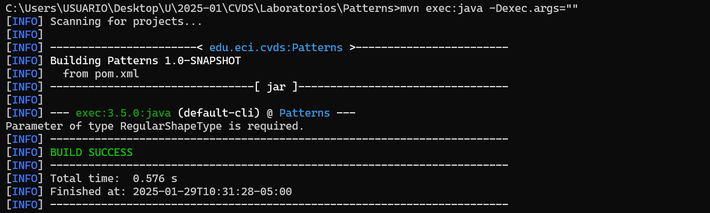
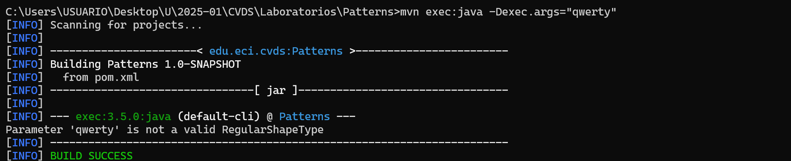
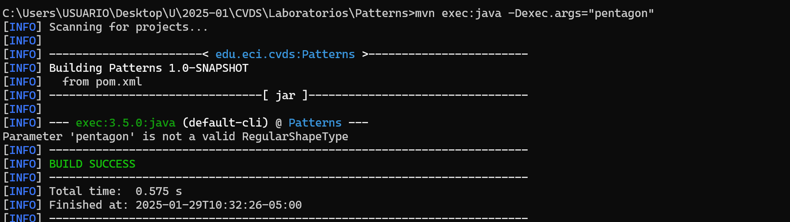
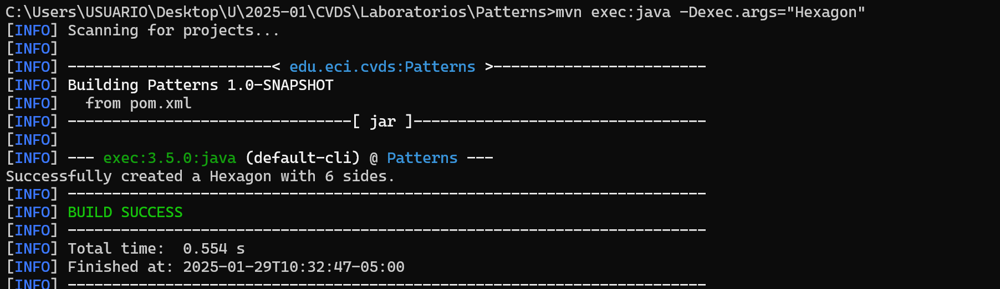

# Laboratorio2
## Integrantes:
### David Sarria y Santiago Amador
# HERRAMIENTA MAVEN
- Cúal es su mayor utilidad:
   
 Maven simplifica los procesos de build (compilar y ejecutar a partir del codigo fuente). Pero podriamos decir que MAVEN puede manejar un proyecto de software .

- Fases de Maven:
    En el orden de ejecución las fases de Maven (para el default lifecycle) son:

    - validate: valida  si el proyecto es correcto y si toda la información esta disponible
    - compile : compila el código fuente del proyecto 
    - test : prueba el código fuente 
    - package: toma el código compilado y lo empaqueta en un JAR
    - verify :
    - install : instala el paquete en el repositorio local para usar como una dependencia
    - deploy: copia el paquete final dentro del repositorio remoto
- Ciclos de vida en Maven:

  - Clean: este ciclo de vida se encarga de eliminar los archivos generados en el último build realizado
  este ciclo se divide en tres fases: pre-clean, clean y post-clean. Es util para iniciar una compilación nueva 
  y asegurarse que los archivos generados por la compilación anterior no afecten con la actual.

  - Default: maneja las fases mencionadas anteriormente y las ejecuta en ese mismo orden.

  - Site: este se compone de tres fases: pre-site, site, post-site y site-deploy. Este lifecycle sirve para generar documentación, 
   metricas o resultado de pruebas en formato HTML para gestionar la página web del proyecto.

- Plugin:
  
   - Un plugin en maven se encarga de centralizar una serie de tareas (goals) que están fuertemente relacionadas
   por ejemplo el plugin de Compile cumple dos goals que son Compile y TestCompile que son usadas por los lifecycle
   de Compile para compilar (Compile goal) y Test para TestCompile.
  

- Repositorio central de maven:

  - Es un almacenamiento público y global de software usados por Apache Maven, las ventajas son que tiene bastantes 
    bibliotecas listas para usar y evita tener que añadir archivos JAR manualmente al proyecto además que si las dependencias no están en el repositorio local 
    las puede buscar en el repositorio central de maven y las almacena en el local para futuros usos. Todo eso se usa por medio del pom.xml en la siguiente imagen se ve en la parte de dependencies como se añade Junit 
  
  
  
### AJUSTAR ALGUNAS CONFIGURACIONES EN EL PROYECTO

Agregamos el compilador de java

### COMPILAR Y EJECUTAR

Usando el comando mvn package obtenemos

De esta manera ya está compilado el proyecto, luego para ejecutar debemos agregar una libreria llamada Exec Maven Plugin y la agregamos al pom.xml

además, debemos decirle a la librería qué clase es la que debe ejecutar cuando demos el comando de ejecucion
**mvn exec:java**

Ahora en java tenemos el código para realizar el saludo personalizado segun parametros

Asi vemos que si no ponemos argumentos me dara el "Hello World!" esperado, ahora si agregamos argumentos 

Pero si agrego otro argumento no dara resultado

 
Por eso si queremos que pueda recibir muchos más argumentos y que todo esté bien, deberemos cambiar el código de App para que sea mucho más completo asi:

De esta manera no importa cuantos argumentos le demos siempre dara el resultado esperado.

# HACER EL ESQUELETO DE LA APLICACIÓN
- Después de hacer el esqueleto de la aplicación con los directorios y añadiendo los métodos de cada uno ahora tenemos que decidir que tipo de fábrica queremos.
  En nuestra implementación hicimos la fábrica simple entonces creamos las clases apropiadas para manejar los casos de uso que nos plantean.

  
## ABSTRACT FACTORY VS SIMPLE FACTORY
- En la investigación realizada encontramos que una fábrica no es mejor que otra, pero tienen diferentes usos.

- La fábrica simple reduce principalmente el uso de la palabra new en la clase principal y nos permite mucha facilidad de creación de objetos sin modificar el código fuente.
  El problema que encontramos fue que la fábrica simple es muy difícil de mantener en cuantos más objetos se añadan o más familias de objetos se necesiten en el caso de uso.
  

- Al contrario de la fábrica abstracta que nos permite crear 'familias' de objetos relacionados entre sí sin tener que especificar las clases concretas y al contrario de la simple
  es más fácil de mantener al poder manejar diferentes familias de objetos a cambio de ser un poco más complejo de implementar. lo antes dicho en la investigación nos decía que ambas tenían funciones distintas,
  pero nosotros creemos que por la facilidad de extender la fábrica abstracta es mejor implementar ese patrón de diseño.
  

## EJECUTAR
- Sin parámetros

- Parámetro: qwerty

- Parámetro: pentagon

- Parámetro: Hexagon

