# Laboratorio2
## Integrantes:
### David Sarria y Santiago Amador
# HERRAMIENTA MAVEN
- Cúal es su mayor utilidad:
   
 Maven simplifica los procesos de build (compilar y ejecutar a partir del codigo fuente). Pero podriamos decir que MAVEN puede manejar un proyecto de software .

- Fases de Maven:
    En el orden de ejecución las fases de Maven (para el default lifecycle) son:
- 
                - validate: valida  si el proyecto es correcto y si toda la información esta disponible
                - compile : compila el codigo fuente del proyecto 
                - test : prueba el codigo fuente 
                - package: toma el codigo compilado y lo empaqueta en un JAR
                - verify :
                - install : isntala el paquete en el repositorio local para usar como una dependencia
                - deploy: copia el paquete final dentro del repositorio remoto
  - Ciclos de vida en Maven:

                  -Clean: este ciclo de vida se encarga de eliminar los archivos generados en el ultimo build realizado
                   este ciclo se divide en tres fases: pre-clean, clean y post-clean. Es util para iniciar una compilacion nueva 
                   y asegurarse que los archivos generados por la compilacion anterior no afecten con la actual.

                  -Default: maneja las fases mencionadas anteriormente y las ejecuta en ese mismo orden

                  -Site: este se compone de tres fases: pre-site, site, post-site y site-deploy. Este lifecycle sirve para generar documentación, 
                   metricas o resultado de pruebas en formato HTML para gestionar la pagina web del proyecto.
  - Plugin:
  
                    - Un plugin en maven se enncarga de centralizar  una serie de tareas (goals) que estan fuertemente relacionadas
                      por ejemplo el plugin de Compile cumple dos goals que son Compile y TestCompile que son usadas por los lifecycle
                      de Compile para compilar (Compile goal) y Test para TestCompile.
  
  
### AJUSTAR ALGUNAS CONFIGURACIONES EN EL PROYECTO

Agregamos el compilador de java

### COMPILAR Y EJECUTAR

usando el comando mvn package obtenemos
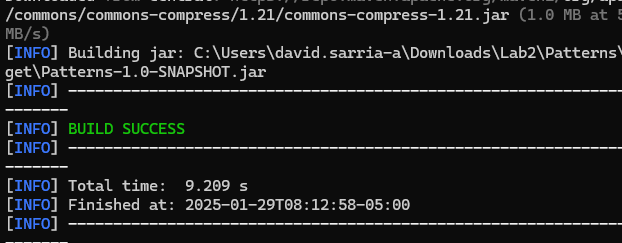
De esta manera ya esta compilado el proyecto, luego paara ejecutar debemos agregar una libreria llamada Exec Maven Plugin y la agregamos al pom.xml
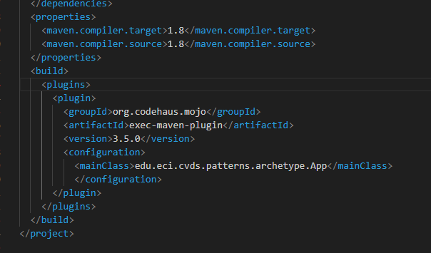
ademas debemos decirle a la libreria que clase es la que debe ejecutar cuando demos el comando de ejecucion
**mvn exec:java**

Ahora en java tenemos el codigo para realizar el saludo personalizado segun parametros
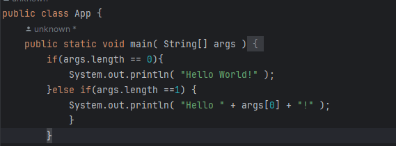
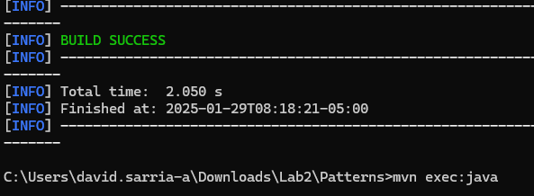
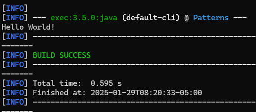
Asi vemos que si no ponemos argumentos me dara el "Hello World!" esperado, ahora si agregamos argumentos 

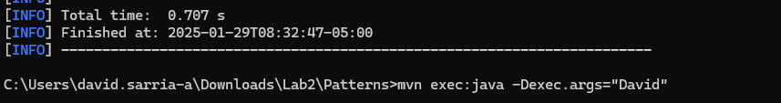
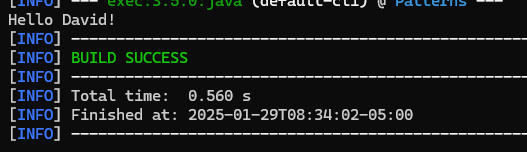
Pero si agrego otro argumento no dara resultado
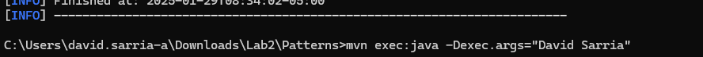
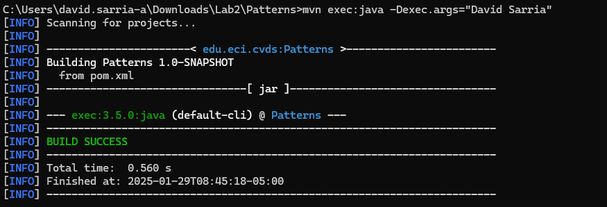 
Por eso si queremos que pueda recibir muchos mas argumentos y que todo este bien, deberemos cambiar el codigo de App para que sea mucho mas completo asi:
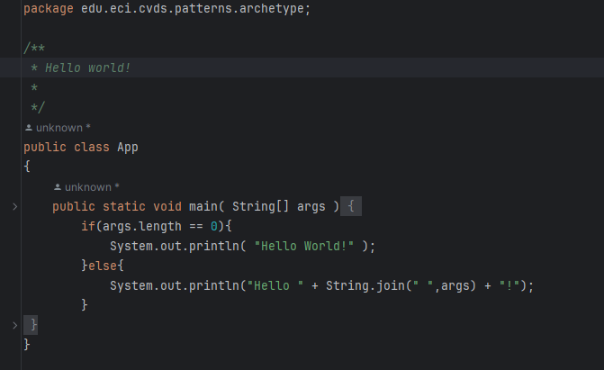
De esta manera no importa cuantos argumentos le demos siempre dara el resultado esperado.

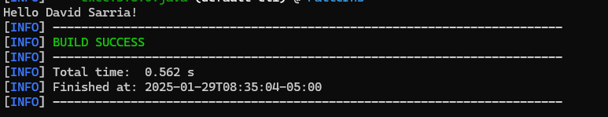